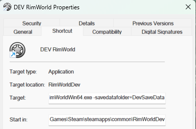
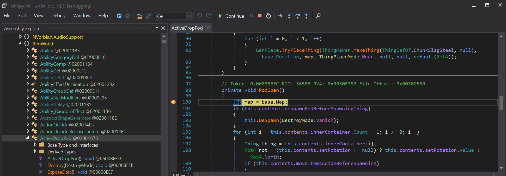

# Guide to setting up a dev environment

> **Note:** This guide is written for Visual Studio Code in Windows.  If you want to use another IDE or OS, YMMV.

## (Optional) Duplicate game installations

If you wish to have the option to play a "pristine" copy of the game, it is best to have a separate installation for development.

1. Navigate to your `steamapps\common` directory.
1. Rename the existing installation directory from `RimWorld` to `RimWorldDev`
1. "Uninstall" the game from Steam (it won't remove any files because it doesn't know of the new renamed directory), and reinstall it.

Now you have a pristine copy that Steam knows about, that you can play with others. And another copy in `RimWorldDev` that you can develop in.

## (Optional) Separate game settings

If I'm playing with friends, I want 4K resolution, full-screen, and UI scaling 1.5x.  When I'm debugging I like the game to be in Window mode, as small as possible (1024x768), and with Development mode enabled!    
These instructions allow you to maintain separate game environments between "pristine" and "dev"

1. The game ships with a README file (`steamapps\common\RimWorld\Readme.txt`)
1. This file details a command-line switch to specify to the game where to store save files _and config_.
    - **Note:** The file also details a `-quicktest` option to fast-load into a tiny map.
1. Create a shortcut to the executable (`RimWorldWin64.exe`), and edit the shortcut details.
1. After the target add the following text: ` -savedatafolder=DevSaveData`
    - This specifies to save the config and games in a directory named `DevSaveData` in the same folder as the executable, eg `steamapps\common\RimWorldDev\DevSaveData`
    

## Clone Multiplayer Mod

> **Note:** It's best to fork the source code to your own account/repository first, and clone that.

1. Navigate to your local game mods directory (eg `steamapps\common\RimWorldDev\Mods`)
1. Clone your code repository here (eg `RimWorldDev\Mods\Multiplayer`)
1. Contrary to the [documentation](https://github.com/rwmt/Multiplayer/blob/master/CONTRIBUTORS.md), __do not__ base your work off the `development` branch. It is well and truly out of date.
1. Copy the `Languages` folder from an original mod installation (eg `steamapps\workshop\content\294100\2606448745\1.5\Languages`) to your mod folder (`steamapps\common\RimWorldDev\Mods\Multiplayer\Languages`)

If you navigate to the `Source` directory you should be able to build the solution now.

The `Source\Client\Multiplayer.csproj` specifies to copy the compiled files back to the Mod directories `Assemblies` and `AssembliesCustom` as a build action.

> **Note:** The build system currently only copies the `.dll` files, not the `.pdb` debug files. Right now you need to manually copy the files `Multiplayer\Source\Client\bin\Multiplayer.pdb` and `MultiplayerCommon.pdb` to `Multiplayer\AssembliesCustom\`

Technically you can edit the code to make changes, build and RimWorld will respect these changes.  However you will want the ability to debug.

## Debugging

Some guides specify to install a specific `mono-2.0-bdwgc.dll`, but I found them to all be out of date. Below is an alternative that I got working.

### dnSpy

This will allow you to debug vanilla RimWorld code.

1. Install [dnSpyEx](https://github.com/dnSpyEx/dnSpy).

### Doorstop

[Rimworld Doorstop](https://github.com/pardeike/Rimworld-Doorstop) allows you to enable the RimWorld Unity debugger. Follow the instructions on their page. Below is a summary.

1. Download the latest [UnityDoorstop Release](https://github.com/NeighTools/UnityDoorstop/releases/tag/v4.4.0) (select the release for your platform, eg `doorstop_win_release_4.4.0.zip`)
    - Unzip and place the files `doorstop_config.ini` and `winhttp.dll` into the __RimWorld__ root directory (not mod directory)
1. Download the latest [Rimworld Doorstop Release](https://github.com/pardeike/Rimworld-Doorstop/releases/tag/v1.5.1.0) (select the `Doorstop.dll`)
    - Place the `Doorstop.dll` file into the __RimWorld__ root directory (not mod directory)
1. Modify the `doorstop_config.ini` as per the [Rimworld Doorstop instructions](https://github.com/pardeike/Rimworld-Doorstop)
    - Ensure you update the following settings:  
        ```ini
        debug_enabled=true
        debug_address=127.0.0.1:56000
        ```

### Start a debug session

1. Open dnSpy.
1. Select File > Open, and select `\RimWorldWin64_Data\Managed\Assembly-CSharp.dll`
1. Select File > Open, and select `\Mods\Multiplayer\AssembliesCustom\Multiplayer.dll`
1. Set a breakpoint
    - For example, Assembly-CSharp > RimWorld > ActiveDropPod > PodOpen
1. From here you have two ways to debug:
    1. Launch the game first and connect the debugger
        - Run the game (`\RimWorldWin64.exe`)
        - From dnSpy, select Debug > Start Debugging
            - Debug engine: Unity (Connect)
            - IP Address: 127.0.0.1
            - Port: 56000
    1. From dnSpy, select Debug > Start Debugging
        - Debug engine: Unity
        - Executable: `\RimWorldWin64.exe`
1. Load the Multiplayer DLL into dnSpy
    1. From dnSpy select Debug > Windows > Modules (this will only be present while connected)
        - This will list all `.dll` files used by `RimWorld.exe`.
    1. Look for `Multiplayer.dll` and open it, but note that it **may not appear right away**.
    1. If you can't find `Multiplayer.dll`, double-click any module with names like `data-0000022CFEF538E0`.
        - Check the left-side **Assembly Explorer** to see if `Multiplayer.dll` appears there.
1. Play the game! Ensure you trigger an appropriate event for the breakpoint set:
    