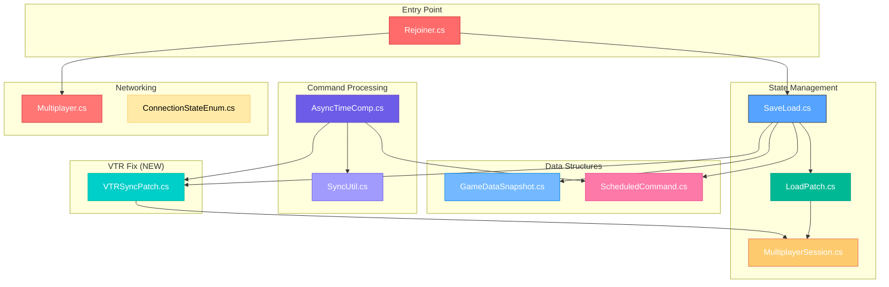
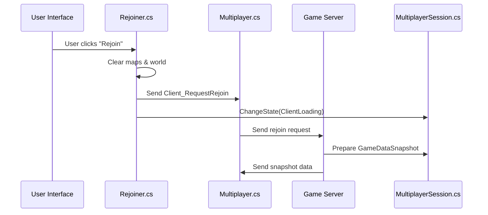
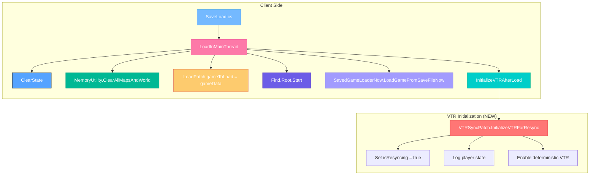
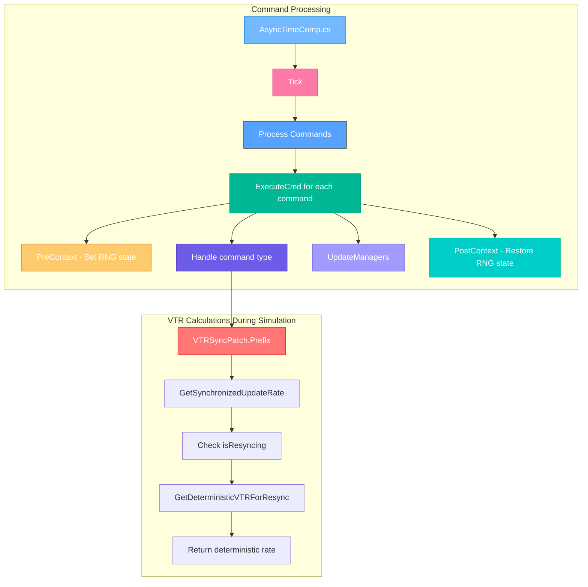
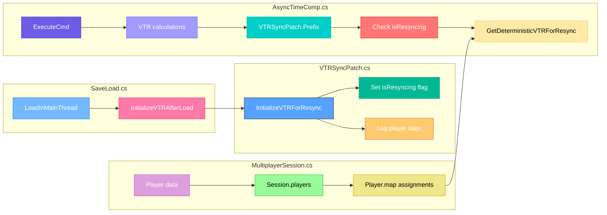
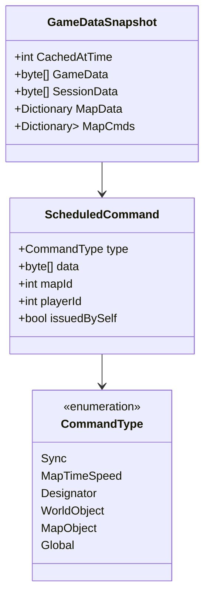
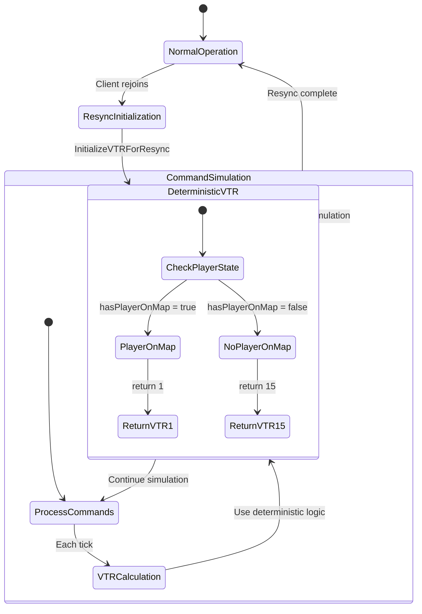

# Resync Process - File Relationships & Data Flow

## **📁 File Architecture Overview**



---

## **🔄 Detailed Data Flow**

### **Phase 1: Rejoin Request Flow**



### **Phase 2: Snapshot Creation**

```mermaid
graph TD
    subgraph "Server Side"
        A[MultiplayerSession.cs] --> B[Create GameDataSnapshot]
        B --> C[Serialize Game Data]
        B --> D[Serialize Session Data]
        B --> E[Serialize Map Data]
        B --> F[Collect Commands]
        
        C --> G[GameDataSnapshot]
        D --> G
        E --> G
        F --> G
    end
    
    subgraph "Data Structure"
        G --> H[CachedAtTime: int]
        G --> I[GameData: byte[]]
        G --> J[SessionData: byte[]]
        G --> K[MapData: Dict<int, byte[]>]
        G --> L[MapCmds: Dict<int, List<ScheduledCommand>>]
    end
    
    style A fill:#74b9ff,stroke:#0984e3,color:white
    style B fill:#fd79a8,stroke:#e84393,color:white
    style C fill:#55a3ff,stroke:#2d3436,color:white
    style D fill:#00b894,stroke:#00a085,color:white
    style E fill:#fdcb6e,stroke:#e17055,color:white
    style F fill:#6c5ce7,stroke:#5f3dc4,color:white
    style G fill:#a29bfe,stroke:#6c5ce7,color:white
```

### **Phase 3: Client State Restoration**



### **Phase 4: Command Simulation**



---

## **🔧 Code Integration Points**

### **VTR Fix Integration**



---

## **📊 Data Structures & Relationships**

### **GameDataSnapshot Structure**



### **VTR State Management**



---

## **🎯 Critical Integration Points**

### **1. Rejoiner → SaveLoad**
- **Trigger**: `Rejoiner.DoRejoin()` calls `SaveLoad.LoadInMainThread()`
- **Data**: `GameDataSnapshot` passed from server to client
- **Purpose**: Restore complete game state

### **2. SaveLoad → VTRSyncPatch**
- **Trigger**: `SaveLoad.InitializeVTRAfterLoad()` calls `VTRSyncPatch.InitializeVTRForResync()`
- **Data**: Session player state for debugging
- **Purpose**: Enable deterministic VTR during resync

### **3. AsyncTimeComp → VTRSyncPatch**
- **Trigger**: Every VTR calculation during command simulation
- **Data**: Current map and thing being processed
- **Purpose**: Ensure identical VTR rates across clients

### **4. VTRSyncPatch → MultiplayerSession**
- **Trigger**: VTR calculations need player state
- **Data**: `Multiplayer.session.players` for map assignments
- **Purpose**: Determine which maps have players for VTR calculation

---

## **🔍 Debugging Integration**

### **Logging Points**

```mermaid
graph TD
    A[VTRSyncPatch.InitializeVTRForResync] --> B[Log: "VTR: Initializing for resync"]
    B --> C[Log each player state]
    C --> D[Log: "VTR: Player {id} on map {map}, status {status}"]
    
    E[VTRSyncPatch.GetDeterministicVTRForResync] --> F[Log: "VTR: Deterministic calculation for map {mapId}"]
    F --> G[Log: "VTR: hasPlayerOnMap = {result}"]
    G --> H[Log: "VTR: Returning rate {rate}"]
    
    I[VTRSyncPatch.Prefix] --> J[Log: "VTR: Sync error: {message}"]
    J --> K[Log: "VTR: Using fallback rate 15"]
    
    style A fill:#74b9ff,stroke:#0984e3,color:white
    style B fill:#fd79a8,stroke:#e84393,color:white
    style C fill:#55a3ff,stroke:#2d3436,color:white
    style D fill:#00b894,stroke:#00a085,color:white
    style E fill:#fdcb6e,stroke:#e17055,color:white
    style F fill:#6c5ce7,stroke:#5f3dc4,color:white
    style G fill:#a29bfe,stroke:#6c5ce7,color:white
    style H fill:#00cec9,stroke:#00b894,color:white
    style I fill:#ff7675,stroke:#d63031,color:white
    style J fill:#ffeaa7,stroke:#fdcb6e,color:black
    style K fill:#dda0dd,stroke:#ba55d3,color:white
```

This comprehensive documentation shows how all the files work together during the resync process, with special emphasis on the VTR fix integration points. 