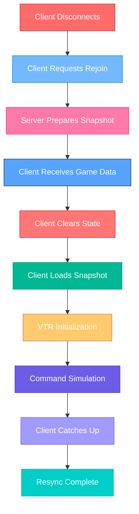
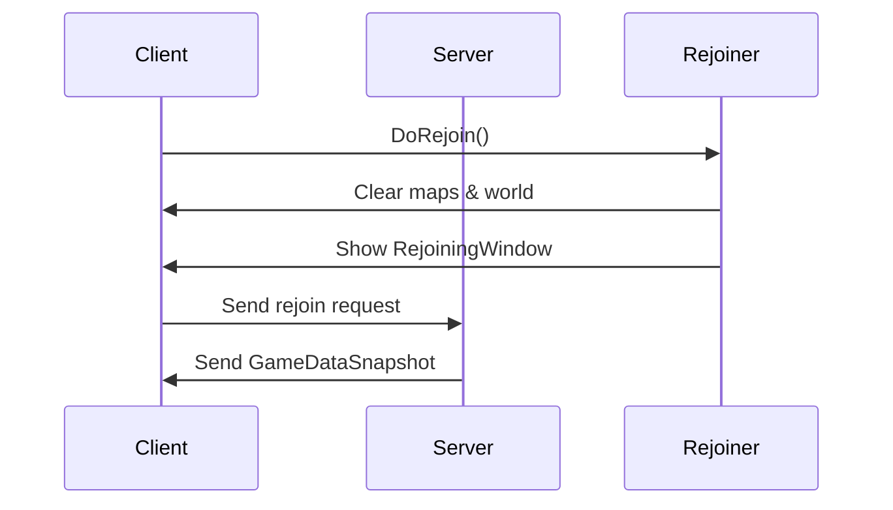
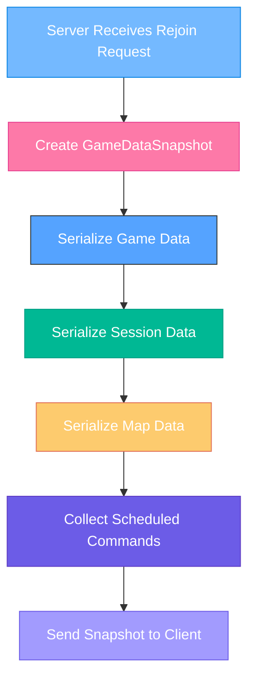
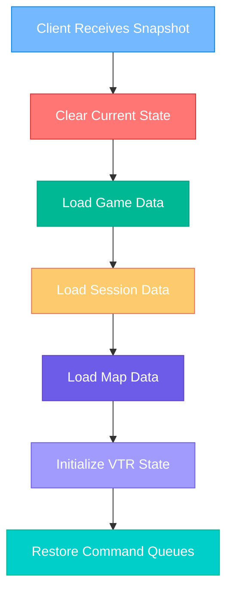
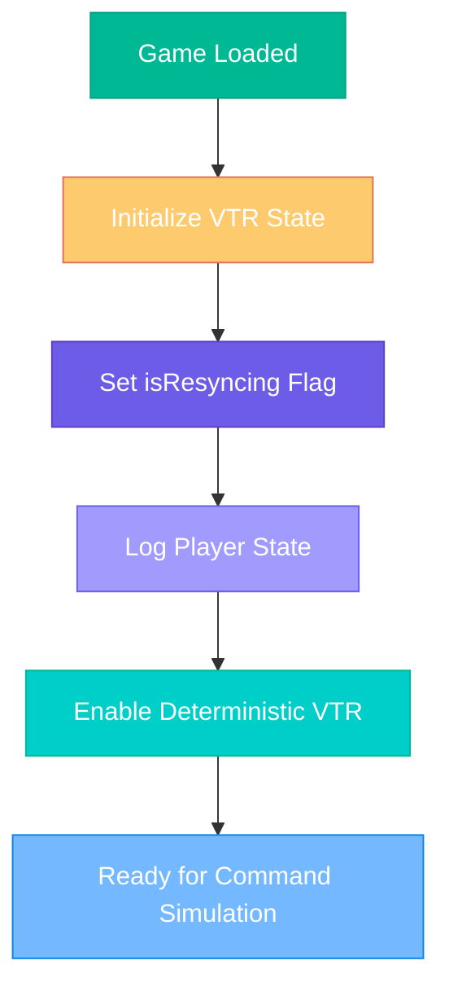
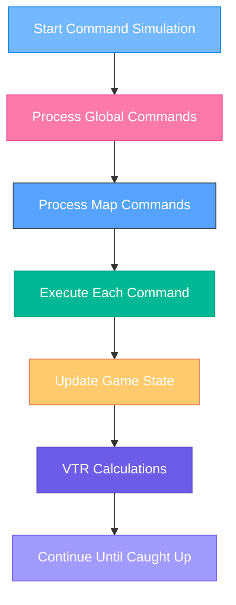
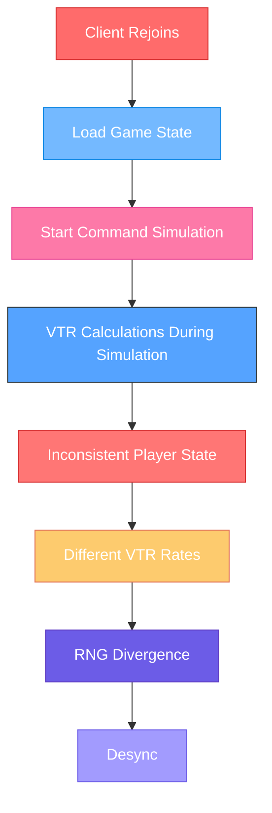
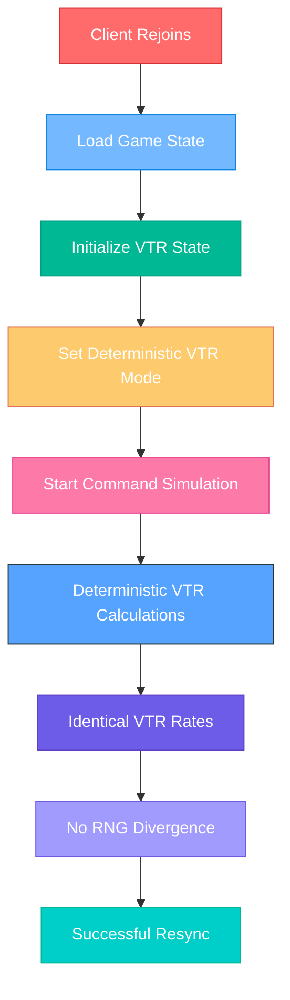
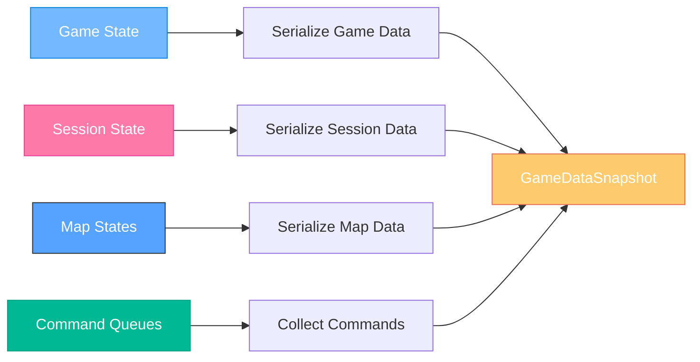
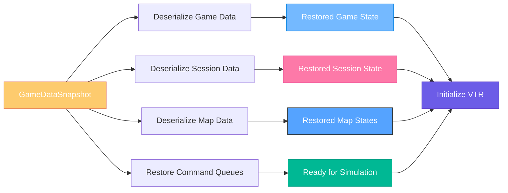

# RimWorld Multiplayer Resync Process - Complete Overview

## **Overview**

The resync process in RimWorld Multiplayer is a critical mechanism that allows clients to rejoin a game and catch up to the current state. This document explains the entire process, from trigger to completion, including the recent VTR (Variable Tick Rate) fix.

---

## **🔄 Resync Process Flow**



---

## **📋 Detailed Process Breakdown**

### **Phase 1: Rejoin Request**
**Files Involved**: `Source/Client/Session/Rejoiner.cs`



**Code Flow**:
```csharp
// Rejoiner.cs
public static void DoRejoin()
{
    Multiplayer.Client.Send(Packets.Client_RequestRejoin);
    Multiplayer.Client.ChangeState(ConnectionStateEnum.ClientLoading);
    
    // Clear all maps and world
    LongEventHandler.QueueLongEvent(() =>
    {
        MemoryUtility.ClearAllMapsAndWorld();
        Current.Game = null;
        // Show rejoining window
    }, "Entry", "LoadingLongEvent", true, null, false);
}
```

### **Phase 2: Server Snapshot Preparation**
**Files Involved**: `Source/Client/Saving/SaveLoad.cs`, `Source/Client/Session/GameDataSnapshot.cs`



**Snapshot Structure**:
```csharp
// GameDataSnapshot.cs
public record GameDataSnapshot(
    int CachedAtTime,                    // When snapshot was created
    byte[] GameData,                     // Main game state (XML)
    byte[] SessionData,                  // Session-specific data (binary)
    Dictionary<int, byte[]> MapData,     // Per-map state (XML)
    Dictionary<int, List<ScheduledCommand>> MapCmds // Commands to replay
);
```

### **Phase 3: Client State Restoration**
**Files Involved**: `Source/Client/Saving/SaveLoad.cs`, `Source/Client/Saving/LoadPatch.cs`



**Loading Process**:
```csharp
// SaveLoad.cs
public static void LoadInMainThread(TempGameData gameData)
{
    ClearState();
    MemoryUtility.ClearAllMapsAndWorld();
    
    LoadPatch.gameToLoad = gameData;
    Find.Root.Start();
    SavedGameLoaderNow.LoadGameFromSaveFileNow(null);
    
    // NEW: Initialize VTR state after load
    InitializeVTRAfterLoad();
}
```

### **Phase 4: VTR Initialization (NEW FIX)**
**Files Involved**: `Source/Client/Patches/VTRSyncPatch.cs`, `Source/Client/Saving/SaveLoad.cs`



**VTR Fix Implementation**:
```csharp
// VTRSyncPatch.cs
public static void InitializeVTRForResync()
{
    if (Multiplayer.Client == null) return;
    
    isResyncing = true;
    MpLog.Debug("VTR: Initializing for resync");
    
    // Log player state for debugging
    var session = Multiplayer.session;
    if (session?.players != null)
    {
        foreach (var player in session.players)
        {
            MpLog.Debug($"VTR: Player {player.id} on map {player.map}, status {player.status}");
        }
    }
}

private static int GetDeterministicVTRForResync(Map map)
{
    // During resync, use deterministic approach
    var session = Multiplayer.session;
    if (session?.players == null) return 15;
    
    // Check if any player is assigned to this map
    bool hasPlayerOnMap = session.players.Any(p => 
        p.map == map.uniqueID && p.status == PlayerStatus.Playing);
    
    return hasPlayerOnMap ? 1 : 15;
}
```

### **Phase 5: Command Simulation**
**Files Involved**: `Source/Client/AsyncTime/AsyncTimeComp.cs`



**Command Processing**:
```csharp
// AsyncTimeComp.cs
public void ExecuteCmd(ScheduledCommand cmd)
{
    CommandType cmdType = cmd.type;
    LoggingByteReader data = new LoggingByteReader(cmd.data);
    
    PreContext(); // Set up RNG state, storyteller, etc.
    
    try
    {
        if (cmdType == CommandType.Sync)
            SyncUtil.HandleCmd(data);
        else if (cmdType == CommandType.MapTimeSpeed)
            SetDesiredTimeSpeed((TimeSpeed)data.ReadByte());
        // ... other command types
        
        UpdateManagers();
    }
    finally
    {
        PostContext(); // Restore RNG state
        Multiplayer.game.sync.TryAddCommandRandomState(randState);
    }
}
```

---

## **🎯 The VTR Problem & Solution**

### **The Problem**


### **The Solution**


---

## **📊 Data Flow Diagrams**

### **Snapshot Creation Flow**


### **Client Restoration Flow**


---

## **🔧 Technical Implementation Details**

### **Key Files and Their Roles**

| File | Purpose | Key Functions |
|------|---------|---------------|
| `Rejoiner.cs` | Entry point for rejoin process | `DoRejoin()` |
| `SaveLoad.cs` | Game state serialization/deserialization | `LoadInMainThread()`, `InitializeVTRAfterLoad()` |
| `GameDataSnapshot.cs` | Data structure for resync | Contains game, session, map data and commands |
| `AsyncTimeComp.cs` | Command execution and ticking | `ExecuteCmd()`, `Tick()` |
| `VTRSyncPatch.cs` | VTR synchronization (NEW) | `GetDeterministicVTRForResync()` |

### **Critical Data Structures**

```csharp
// GameDataSnapshot - What gets transferred during resync
public record GameDataSnapshot(
    int CachedAtTime,                    // When snapshot was created
    byte[] GameData,                     // Main game state (XML)
    byte[] SessionData,                  // Session-specific data (binary)
    Dictionary<int, byte[]> MapData,     // Per-map state (XML)
    Dictionary<int, List<ScheduledCommand>> MapCmds // Commands to replay
);

// ScheduledCommand - Individual command to replay
public class ScheduledCommand
{
    public CommandType type;             // Type of command
    public byte[] data;                  // Command data
    public int mapId;                    // Which map this affects
    public int playerId;                 // Who issued the command
    public bool issuedBySelf;            // Whether local player issued it
}
```

### **VTR Fix Implementation Details**

```csharp
// VTRSyncPatch.cs - The fix
public static class VTRSyncPatch
{
    private static bool isResyncing = false;  // Track resync state
    
    // Called during resync initialization
    public static void InitializeVTRForResync()
    {
        isResyncing = true;
        // Log player state for debugging
    }
    
    // Deterministic VTR calculation during resync
    private static int GetDeterministicVTRForResync(Map map)
    {
        var session = Multiplayer.session;
        if (session?.players == null) return 15;
        
        // Simple deterministic check: any player on this map?
        bool hasPlayerOnMap = session.players.Any(p => 
            p.map == map.uniqueID && p.status == PlayerStatus.Playing);
        
        return hasPlayerOnMap ? 1 : 15;
    }
    
    // Main VTR calculation (patches GenTicks.GetCameraUpdateRate)
    static bool Prefix(Thing thing, ref int __result)
    {
        if (Multiplayer.Client == null) return true; // Single player
        
        try
        {
            __result = GetSynchronizedUpdateRate(thing);
            return false; // Skip original implementation
        }
        catch (Exception ex)
        {
            Log.Error($"VTR Sync error: {ex.Message}");
            __result = 15; // Safe fallback
            return false;
        }
    }
}
```

---

## **🎯 Success Criteria**

### **Resync Success Indicators**
- [ ] Client successfully rejoins without desync
- [ ] All game state is identical across clients
- [ ] VTR calculations are deterministic during resync
- [ ] No RNG divergence after resync
- [ ] Commands execute identically on all clients

### **Debugging Tools**
- **MpLog**: Logs VTR initialization and player state
- **SyncDebugPanel**: Shows current sync state
- **Command Logging**: Tracks command execution during resync

---

## **📝 Summary**

The resync process is a complex but critical mechanism that allows clients to rejoin multiplayer games. The recent VTR fix addresses a specific issue where Variable Tick Rate calculations during resync could cause desyncs due to inconsistent player state.

**Key Improvements**:
1. **Deterministic VTR**: Ensures identical VTR calculations during resync
2. **Resync Detection**: Tracks when resync is in progress
3. **Player State Logging**: Debugs player/map assignments during resync
4. **Safe Fallbacks**: Handles edge cases gracefully

This fix ensures that all clients calculate the same VTR rates during resync, preventing the tick timing divergence that was causing desyncs. 